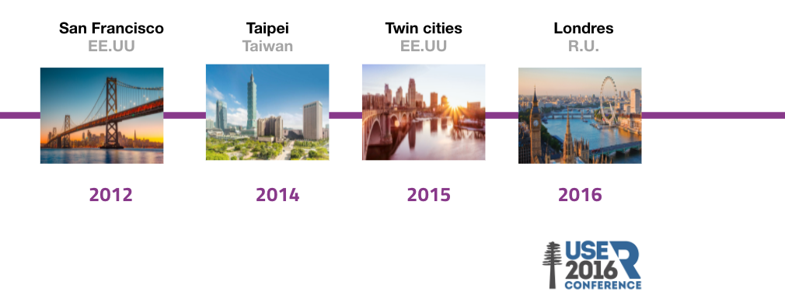
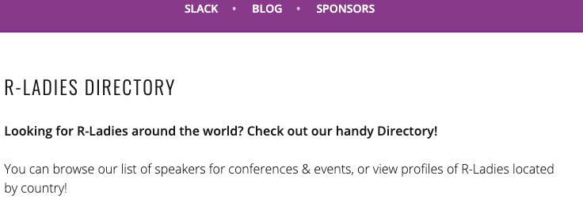
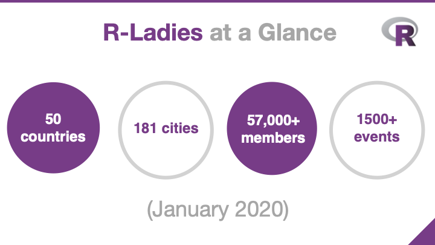
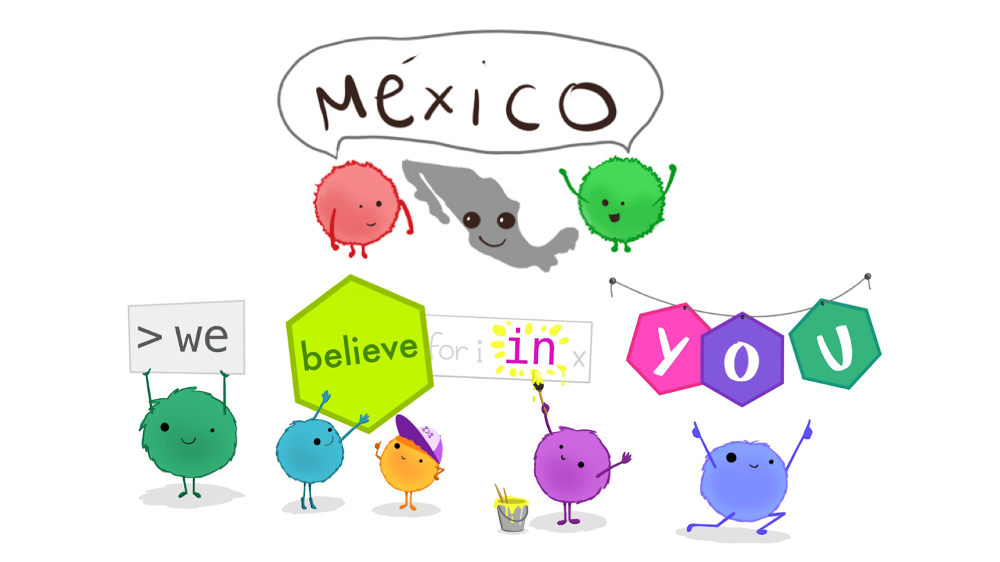
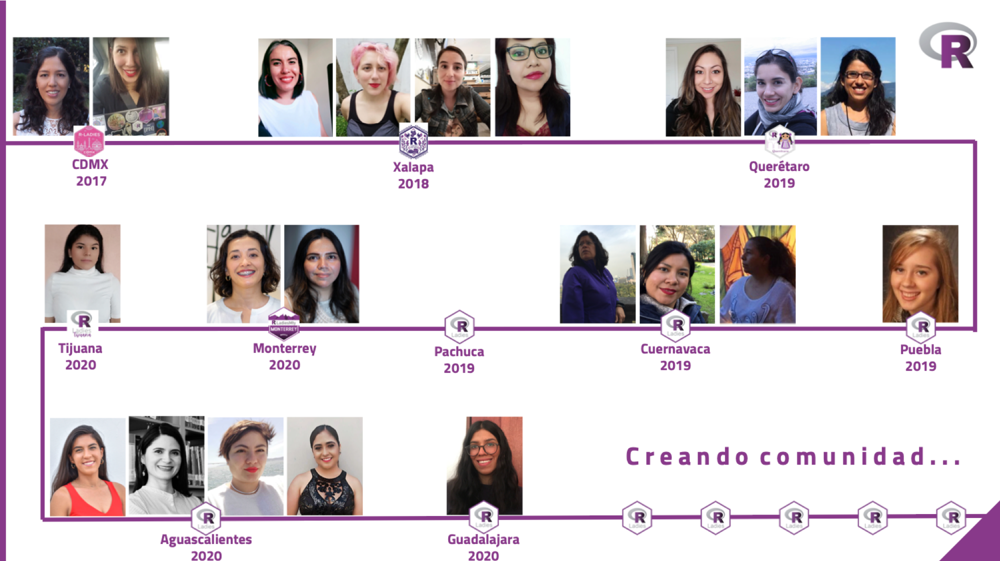
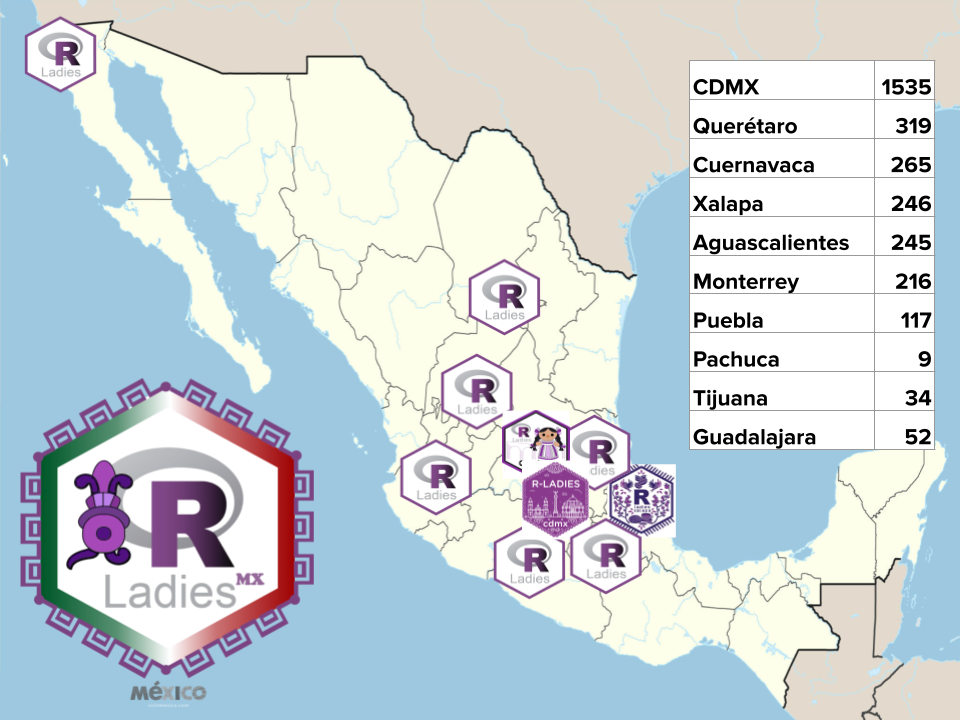
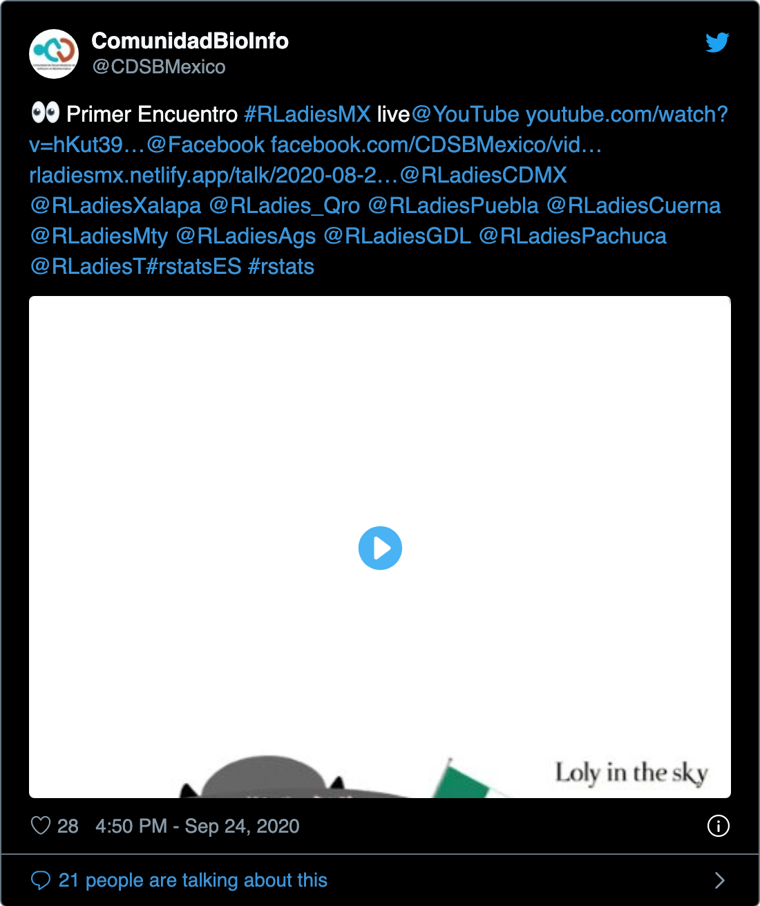
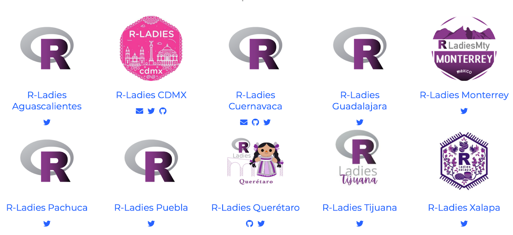
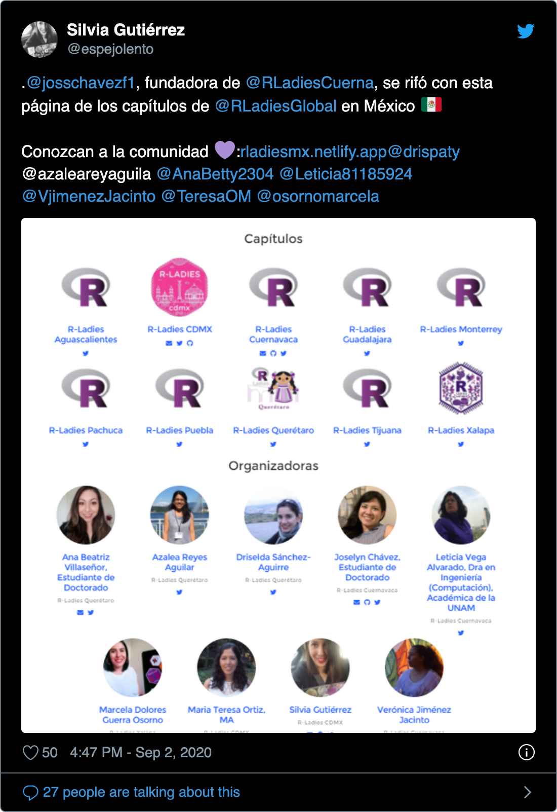

```{r setup, include=FALSE}
library("lubridate")
library(wordcloud)
library(wordcloud2)
library(tm)
library("meetupr")
library("raster")
library(knitr)                              # paquete que trae funciones utiles para R Markdown
library(tidyverse)                          # paquete que trae varios paquetes comunes en el tidyverse
library(icon)                               # paquete para iconos
library(emo)                                # paquete para emojis
# opciones predeterminadas
knitr::opts_chunk$set(echo = FALSE,         # FALSE: los bloques de código NO se muestran
                      dpi = 300,            # asegura gráficos de alta resolución
                      warning = FALSE,      # los mensajes de advertencia NO se muestran
                      error = FALSE)        # los mensajes de error NO se muestran
```


class:  left, bottom
background-image: url(https://rladies.org/wp-content/uploads/2016/12/R-LadiesGlobal.png)
background-position: 94% 10%
background-size: 22%


# `r rmarkdown::metadata$title`
----
## **`r rmarkdown::metadata$subtitle`**
### `r rmarkdown::metadata$author`
### `r rmarkdown::metadata$date`

---

name: Rladies Global
class: inverse, middle, center


# R-ladies Global


---

# ¿Qué es R-ladies?

.pull-left[

Organización mundial que promueve la **diversidad de género** en la comunidad de R en un **ambiente amigable y seguro**.

Surge para apoyar a minorías y lograr su potencial de programación.

]

.pull-right[

```{r echo=FALSE, fig.cap="Artwork by @allison_horst"}
knitr::include_graphics("https://github.com/allisonhorst/stats-illustrations/raw/master/rstats-artwork/welcome_to_rstats_twitter.png")
```


]


---

# ¿Cuál es su misión?

.pull-left[

Apoyar a que más **mujeres y personas de género no-binario** desarrollen paquetes y sean parte de la comunidad de R, a través de:


- Programadorxs

- Desarrolladorxs

- Ponentes

- Lideres

]

.pull-right[

```{r echo=FALSE, fig.cap="Artwork by @allison_horst"}
knitr::include_graphics("https://github.com/allisonhorst/stats-illustrations/raw/master/rstats-artwork/r_first_then.png")
```


]

---

# Historia

```{r echo=FALSE, out.width="90%", fig.align='center'}
knitr::include_graphics("https://media.giphy.com/media/J4O6jJTsi2wRBU2oPG/giphy.gif")
```


---

# Historia


.pull-left[

```{r echo=FALSE}
knitr::include_graphics("https://avatars.sched.co/6/66/792883/avatar.jpg?2cd")
```


]

.pull-right[

### Gabriela de Queiroz

- 2012: Brazil to San Francisco 

- Estudiante de Maestría

- Descubre [*Meetup*](https://www.meetup.com/es/)

```{r echo=FALSE, fig.height=3}
knitr::include_graphics("https://play-lh.googleusercontent.com/GrdSMa25Tb_jImJOyRfWZ4b0wTDgZrVzGpr0thZqR0PnLoYjrrb9Gcc3yilAqBmvbbE")
```

]

---

# Anécdota

```{r echo=FALSE, out.width="80%", fig.align='center'}
knitr::include_graphics("https://media.giphy.com/media/pF64H9vS7O5zi/giphy.gif")
```

---

# Visión


```{r echo=FALSE, out.width="60%",fig.align='center'}
knitr::include_graphics("https://miro.medium.com/max/1400/1*BneIIAG4i12bH1RO5dH-yw.jpeg")
```

---

# Idea

```{r echo=FALSE, fig.show='hold', out.width="30%", fig.align = "center"}
knitr::include_graphics("https://www.r-project.org/Rlogo.png")
knitr::include_graphics("https://bloximages.newyork1.vip.townnews.com/nwmissourinews.com/content/tncms/assets/v3/editorial/5/98/59836cfc-dc53-11e7-b250-879c105a871a/5a2af102da62c.image.jpg?resize=775%2C775")
```

---

# Primer meeting

**October 1, 2012**

- Solo 8 personas

--

- Halloween 

```{r echo=FALSE, out.width="60%", fig.align='center'}
knitr::include_graphics("https://estaticos-cdn.prensaiberica.es/clip/65a519f5-6a97-41bb-b643-0364a90981ab_16-9-aspect-ratio_default_0.jpg")
```

---

# Primeros capítulos

```{r echo=FALSE, out.width="120%", fig.align='center'}

```

---

# ¿Buscas R-ladies?

Puros ponentes hombres en conferencias o puros hombres en paneles de discusión.

--

¡No hay escusa! Puedes encontar a alguien en el [**directorio**](https://rladies.org/)

```{r echo=FALSE, out.width="80%", fig.align='center'}

```

---

# ¿Cuántas somos?


```{r echo=FALSE, out.width="90%", fig.align='center'}

```

.tiny[Tomada de [aquí](https://github.com/rladies/rladies_global_presentations/blob/master/20200129_rstudioconf/RLadies_rstudioconf_2020.pdf)]

---

# R-ladies Global

```{r echo=FALSE, out.width="90%", fig.align='center'}
knitr::include_graphics("https://player.slideplayer.com/97/16858454/slides/slide_13.jpg")
```

.tiny[Tomada de [aquí](https://slideplayer.com/slide/16858454/)]
---

# R-ladies Global

```{r cache=TRUE, include=FALSE}
meetup_groups <- find_groups(text = "r-ladies")
# Keep only groups whose name contains the string "r-ladies"
meetup_groups <- meetup_groups[which(grepl("r-ladies",
                                           tolower(meetup_groups$name))),]

rladies <- meetup_groups[meetup_groups$organizer == "R-Ladies Global", 1:20]
```

```{r fig.height=4}

df <- data.frame(Date = as.Date(rladies$created), count = 1) %>%
  complete(Date = seq.Date(min(Date), max(Date), by="day")) %>%
  # mutate(dategroup = lubridate::floor_date(Date, "6 months")) %>%
  mutate(dategroup = format(Date, "%Y-%m")) %>%
  group_by(dategroup) %>%
  summarise(count_ymonth = sum(count, na.rm = TRUE)) %>%
  mutate(cum_sum = cumsum(count_ymonth))

ggplot(data = df, aes(x = dategroup, y = cum_sum)) +
  geom_bar(stat = "identity", color = "#88398A", fill = "#88398A", binwidth = 1) +
  theme_bw(10) + xlab("") + ylab("Número de capítulos") +
  #theme(text = element_text(family="amatic-sc",size = 24)) +
  ggtitle("Crecimiento de R-Ladies Global") +
  theme(axis.text.x = element_text(angle = 45, vjust = 1, hjust=1)) +
  scale_x_discrete(breaks = df$dategroup[seq(1, length(df$dategroup), by = 2)])

```

---

## Por continente

```{r  fig.height=4}
df <- data.frame(country = rladies$country) %>%
  merge(raster::ccodes()[,c("ISO2", "continent")],
        by.x = "country", by.y = "ISO2", all.x = T) %>%
  group_by(continent) %>%
  summarise(count = n())

# Blank theme
blank_theme <- theme_minimal()+
  theme(
  axis.title.x = element_blank(),
  axis.title.y = element_blank(),
  panel.border = element_blank(),
  panel.grid=element_blank(),
  axis.ticks = element_blank(),
  plot.title = element_text(size = 14, face = "bold")
  )


ggplot(df) +
 aes(x = reorder(continent, count), fill = continent, weight = count) +
 geom_bar() +
 scale_fill_brewer(palette = "BuPu", 
 direction = 1) +
 labs(x = "Continente", y = "Número de capítulos") +
 coord_flip() +
 theme_classic(16)

```

---

name: Rladies MX
class: inverse, middle, center


# R-ladies México

---

# R-ladies México

Surge durante la pandemia con la idea de juntarnos para apoyarnos y crear comunidad

```{r echo=FALSE, out.width="80%", fig.cap="Modified of @allison_horst", fig.align="center"}

```

---

# Historia de R-ladies en México

```{r echo=FALSE, out.width="120%", fig.align='center'}

```


---

# ¿Dónde estamos?

```{r echo=FALSE, out.width="75%", fig.align='center'}

```

---

# Miembros por capítulo

```{r echo=FALSE,fig.height=3.5}

df <- rladies %>% 
  filter(country == "MX") %>% 
  arrange(-members)

df %>%
 ggplot() +
 aes(x = reorder(city,members), weight = members) +
  labs(x = "Ciudad", y = "Número de participantes") +
  geom_bar(fill = "#440154") +
   coord_flip() +
  theme_classic(16)


```

---

# Palabras en los titulos

```{r  message=FALSE, warning=FALSE, include=FALSE}
urlname <- df %>% 
  filter(urlname != "rladies-pachuca") %>% 
  select(urlname) 

events <- urlname$urlname %>% 
  purrr::map_df(get_events, "past")

events %>% 
  arrange(desc(time))


text <- paste(events$name, collapse  = " ")
docs <- Corpus(VectorSource(text))

docs <- docs %>%
  tm_map(removeNumbers) %>%
  tm_map(removePunctuation) %>%
  tm_map(stripWhitespace)

docs <- tm_map(docs, content_transformer(tolower))
docs <- tm_map(docs, removeWords, stopwords("spanish"))
docs <- tm_map(docs, removeWords, c("rladies", "meetup", "datos"))

dtm <- TermDocumentMatrix(docs) 
matrix <- as.matrix(dtm) 
words <- sort(rowSums(matrix),decreasing=TRUE) 
df_docs <- data.frame(word = names(words),freq=words)

set.seed(1234) # for reproducibility 
# my_graph <- wordcloud2(data=df_docs, size=1.6)
# htmlwidgets::saveWidget(my_graph,here::here("2021TIB_Rladies/slides/img/cloud.html"),selfcontained = F)
# 
# webshot::webshot(here::here("2021TIB_Rladies/slides/img/cloud.html"),here::here("2021TIB_Rladies/slides/img/cloud.png"), delay =20, vwidth = 480, vheight=480)

```

```{r fig.height=3.5}
wordcloud(words = df_docs$word, freq = df_docs$freq,
          random.order=FALSE, 
          min.freq = 1,  
          rot.per=0.35,            
          colors=brewer.pal(8, "Dark2")
          )
```

---

# Primer encuentro de R-ladies MX

```{r fig.height=4, fig.align='center'}
# tweetrmd::tweet_screenshot(
#   tweetrmd::tweet_url("CDSBMexico", "1309248985350184960"),
#   maxwidth = 550,
#   file = here::here("2021TIB_Rladies/slides/img/tweet-prim.png"),
#   theme = "dark"
#   )


```

---

# Organización


```{r echo=FALSE, out.width="100%", fig.align='center'}

```

---

# Página web 


```{r fig.height=3.5, fig.align='center'}
# tweetrmd::tweet_screenshot(
#   tweetrmd::tweet_url("espejolento", "1301275632140201984"),
#   maxwidth = 550,
#   file = here::here("2021TIB_Rladies/slides/img/tweet-pag.png"),
#   theme = "dark"
#   )


```


---

# Comunidad

```{r echo=FALSE, fig.align='center'}
knitr::include_graphics("https://media.giphy.com/media/LnEPkxpUit0rNVX2Sd/giphy.gif")
```

